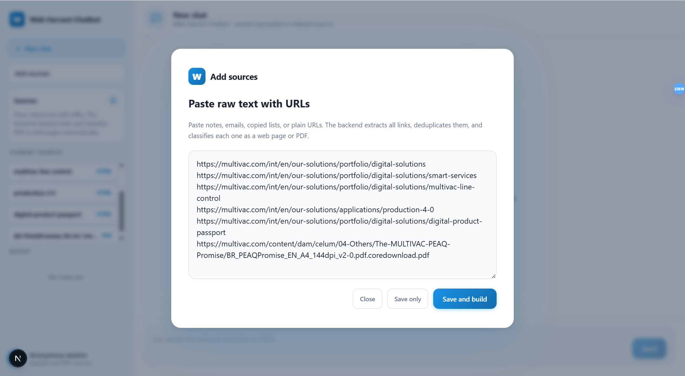
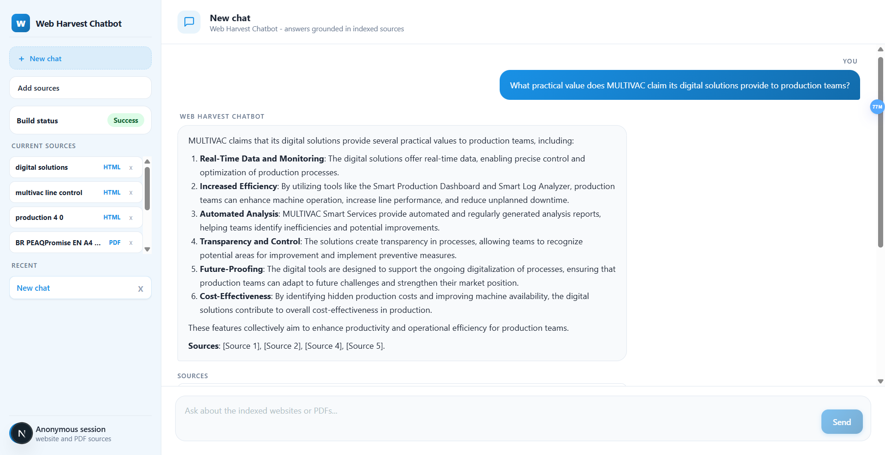

# Web Harvest Chatbot

`Web Harvest Chatbot` is a config-driven starter for building a retrieval-augmented chatbot from websites and PDFs.

The app now uses a Next.js/React frontend and a FastAPI backend. Paste a list of URLs into the web UI, click **Save and build**, and the backend scrapes, chunks, embeds, and indexes the content into Supabase pgvector.

The full workflow:

1. Paste URLs in the web UI (or edit `config/sources.json` directly)
2. The app extracts and deduplicates all links from the pasted text
3. Scrapes HTML pages and extracts text from PDFs
4. Builds a merged knowledge base
5. Chunks and embeds content into Supabase pgvector
6. Chat with the indexed corpus from the same UI

## What it includes

- **Web UI source management**: paste raw text containing URLs, the app extracts and deduplicates links automatically
- **One-click ingestion**: "Save and build" triggers the full pipeline in the background; build status is shown live in the sidebar
- **Automatic database sync**: removing a source from the UI also deletes its chunks from the vector database
- Config-driven source list in `config/sources.json` (synced automatically with the UI)
- HTML scraping and PDF text extraction in `scraper.py`
- Vector indexing in `build_index.py`
- One-command ingestion runner in `pipeline.py`
- Supabase SQL for vector search and chat persistence
- FastAPI backend for RAG, conversations, sources, and weak local identity
- Next.js frontend with a browser-local display name and UUID identity
- Shared branding config in `config/project.json`

## UI example

### Add sources



### Chat interface



## Project structure

- `config/project.json`: app name, assistant name, and UI copy
- `config/sources.json`: active crawl targets for this project
- `config/sources.example.json`: reusable sample source configuration
- `scraper.py`: crawls pages and PDFs into `data/`
- `build_index.py`: chunks content and writes embeddings to Supabase
- `pipeline.py`: runs scrape + index in sequence
- `scripts/run-pipeline-background.mjs`: runs rebuilds in the background
- `sql/`: database schema and RPC definitions
- `app/`, `components/`, `lib/`: web app and API routes
- `docs/setup/SETUP.md`: detailed setup instructions
- `docs/architecture.md`: high-level system design

## How the pipeline works

```text
config/sources.json
  -> scraper.py
  -> data/pages/*.json
  -> data/knowledge_base.json
  -> build_index.py
  -> Supabase pgvector
  -> FastAPI RAG API
  -> Next.js chat UI
```

## Quick start

### 1. Install dependencies

```bash
pip install -r requirements.txt
pip install -r backend/requirements.txt
npm install
```

### 2. Configure environment variables

There are two ways to set the required variables:

**Option A — In-app settings (local development only)**

Start the app and open the settings panel (gear icon in the sidebar). You can enter all variables directly in the UI. Changes are saved to your local `.env` file. Sensitive values like API keys will show a warning before saving — this flow is intended only for local testing and should not be used on any internet-facing deployment.

**Option B — Edit `.env` directly**

Copy `.env.example` to `.env` and fill in the values before starting the app. This is the recommended approach for any shared or production environment.

```env
OPENAI_API_KEY=
OPENAI_CHAT_MODEL=gpt-4o-mini
OPENAI_EMBED_MODEL=text-embedding-3-small
SUPABASE_URL=
SUPABASE_SERVICE_ROLE_KEY=
NEXT_PUBLIC_API_BASE_URL=http://localhost:8000
FRONTEND_ORIGIN=http://localhost:3000
```

Optional chunk tuning:

```env
CHUNK_CHARS=1200
CHUNK_OVERLAP_CHARS=150
```

### 3. Initialize Supabase

Run these scripts in Supabase SQL Editor:

```text
sql/schema.sql
```

This creates the vector table, `match_chunks()` RPC, local weak identity table, conversations, and messages. Supabase Auth is not required for the current FastAPI flow.

### 4. Start the backend

```bash
cd backend
uvicorn app.main:app --reload --host 0.0.0.0 --port 8000
```

FastAPI docs are available at `http://localhost:8000/docs`.

### 5. Start the web app

```bash
npm run dev
```

Open `http://localhost:3000`, enter a display name, and start chatting. The frontend stores a browser-local UUID to separate chat history without Supabase Auth.

### Docker Compose

After `.env` is configured and `sql/schema.sql` has been run in Supabase, start the app with:

```bash
docker compose up --build
```

This starts:

```text
Frontend: http://localhost:3000
Backend:  http://localhost:8000
API docs: http://localhost:8000/docs
```

The Compose setup uses your external Supabase project. It does not start a local database.

### 6. Add sources and build

1. Click **Add sources** in the sidebar
2. Paste any text containing URLs (plain list, email, notes — the app extracts all links)
3. Click **Save and build**

The app scrapes the URLs, chunks the content, generates embeddings, and indexes everything into Supabase. Build progress is shown live in the sidebar. When the build finishes, the knowledge base is ready to query.

To remove a source, click the **x** next to it in the sidebar. Its chunks are deleted from the database immediately.

#### Advanced: manual ingestion from the command line

```bash
python pipeline.py
python scraper.py --test
python scraper.py --limit 10
python build_index.py --reset
python pipeline.py --test --reset-index
```

#### Advanced: edit sources directly

You can also edit `config/sources.json` by hand. Each entry can be a plain URL string or an object:

```json
{ "url": "https://example.com", "title": "Example", "type": "html", "category": "website" }
```

See `config/sources.example.json` for reference.


## Example use cases

- Company knowledge chatbot from marketing pages and brochures
- Customer support assistant from docs + downloadable PDFs
- Research assistant for niche websites with mixed HTML/PDF content
- Lightweight vertical RAG prototype before building a larger ingestion stack

## Notes

- `data/pages/` and `data/knowledge_base.json` are generated artifacts and ignored by git.
- `data/build-status.json` and `data/build.log` are local runtime artifacts and ignored by git.
- The vector search uses `match_chunks()` from `sql/schema.sql`.
- The app stores chat history in Supabase conversations and messages tables.
- The current local identity flow is intentionally weak and intended for demos/development, not production authentication.
- The current scraper is intentionally simple and easy to adapt, not a full distributed crawler.

## License

This repository is licensed under the MIT License.
